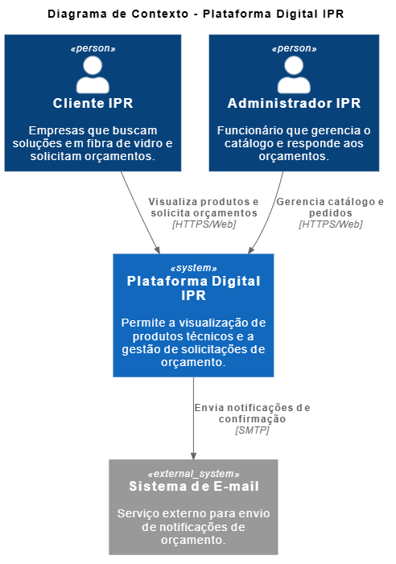
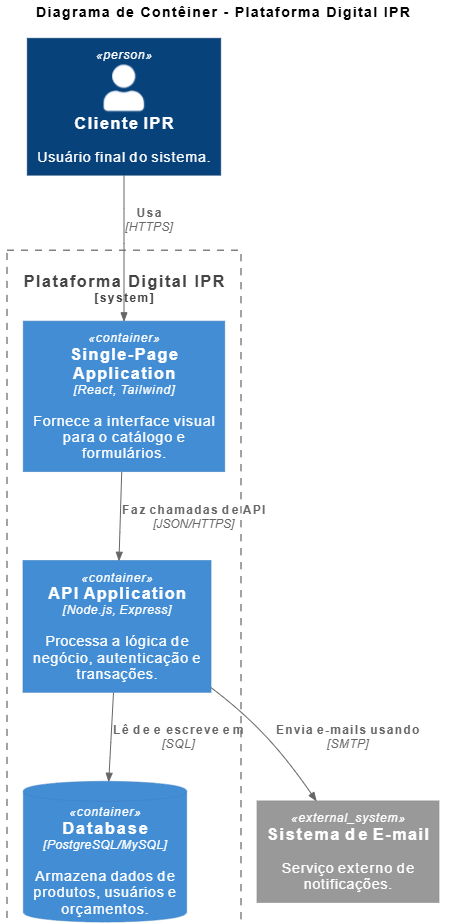

# Plataforma Digital IPR - Modernização Industrial

Este projeto consiste no desenvolvimento de uma aplicação web fullstack para a empresa onde eu trabalho atualmente chamada IPR (Industria de Plastico Reforçado) . O objetivo é transformar o atual site institucional em uma plataforma interativa de gestão de orçamentos e catálogo de produtos técnicos.

---

## Domínio do Problema

A IPR é uma empresa especializada em materiais compósitos (fibra de vidro) para os setores de energia e saneamento. Atualmente, a interação com o cliente para orçamentos depende de processos manuais. 

Qual o desafio e o meu objetivo com esse projeto?

1. Vou criar um catalogo digital gerenciavel (CRUD) para as soluções e processos que existem dentro da empresa que no caso são Pultrusão, Moldagem e Prensagem.
2. Implementar tambem um fluxo de orçamento e transação onde o cliente pode fazer um pedido desejado pelo proprio site garantindo a integridade dos dados.
3. Prover tambem uma área administrativa segura para a gestao desses pedidos.

---

## 🛠 Tecnologias e Justificativas

| Tecnologia | Papel no Projeto | Justificativa |
| :--- | :--- | :--- |
| **React.js** | Front-end | Arquitetura baseada em componentes, facilitando a reutilização de código e criando uma interface rápida e reativa. |
| **Node.js** | Back-end | Alta performance com I/O não bloqueante e unificação da linguagem JavaScript em todo o stack. |
| **Express** | Framework Web | Agilidade na criação de rotas e APIs REST seguras. |
| **CSS Modules** | Estilização | Estilos escopados por componente, mantendo o código limpo e evitando conflitos sem complexidade extra. |
| **PostgreSQL** | Banco de Dados | Banco relacional que garante a segurança das transações de orçamentos (ACID). |

A ideia é focar nessas linguagens nao apenas para esse projeto, mas focar para aprender o suficiente para fazer projetos futuros tambem!

---

## Requisitos do Sistema

### Requisitos Funcionais (RF)
- [ ] **RF01 - Gestão de Produtos:** O administrador deve poder cadastrar, ler, atualizar e excluir produtos (CRUD).
- [ ] **RF02 - Catálogo Público:** Visitantes podem visualizar os produtos e detalhes técnicos.
- [ ] **RF03 - Autenticação:** Sistema de login via Token para clientes e administradores.
- [ ] **RF04 - Solicitação de Orçamento:** Fluxo transacional onde o cliente seleciona itens e finaliza um pedido de orçamento.

### Requisitos Não Funcionais (RNF)
- [ ] **RNF01 - Segurança:** Uso de JWT (JSON Web Tokens) para proteção de rotas.
- [ ] **RNF02 - Responsividade:** Interface adaptável para dispositivos móveis e desktop.

---

## Organização de Tarefas (Desenvolvimento individual, posso tirar e adicionar tarefas conforme for fazendo o projeto)

1. [x] **Planejamento:** Definição de domínio e escolha da stack tecnológica.
3. [x] **Planejamento:** Criação da arquitetura do projeto seguindo o modelo C4
3. [ ] **Ambiente:** Setup do repositório e estrutura inicial das pastas `client` e `server`.
4. [ ] **Database:** Modelagem das tabelas de Produtos, Usuários e Orçamentos.
5. [ ] **API:** Desenvolvimento dos endpoints REST (CRUD de produtos).
6. [ ] **UI/UX:** Construção das telas em React e integração com o Back-end.
7. [ ] **Finalização:** Implementação da transação de orçamento e testes unitários.

---

##  Arquitetura do Sistema (Modelo C4)

Para o planejamento da **Plataforma IPR**, utilizei o **Modelo C4** para detalhar a estrutura do software em diferentes níveis de abstração.

### Nível 1: Diagrama de Contexto
Este diagrama apresenta a interação do sistema com os usuários (Clientes e Administradores) e o ambiente externo.

### Nível 2: Diagrama de Contêineres
Aqui detalhei as tecnologias escolhidas (**React** e **Node.js**) e a comunicação entre o Front-end, Back-end e Banco de Dados.

---

## Design UI/UX (Figma)

O design da interface esta sendo planejado no **Figma**, focando em uma experiência de usuário moderna, intuitiva e responsiva, inspirada em referências de grandes indústrias e plataformas SaaS.

- **Protótipo Interativo:** [https://www.figma.com/design/8vTAVVyd6u4qh3qjlBr60s/Projeto-IPR?node-id=0-1&t=NPaafT9QvBUEkvvw-1]
- **Paleta de Cores:** Azul Industrial (#F26522), Cinza Grafite (#2D2D2D), Gelo (#F3F4F6) e Laranja Industrial(#F26522).

---

